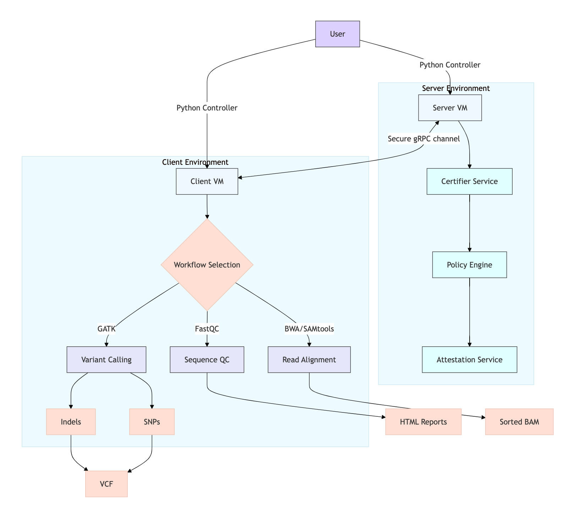

# Confidential Computing for Bioinformatics Workshop



## Table of Contents
1. [Overview](#overview)
2. [Pipeline Architecture](#pipeline-architecture)
3. [Key Files](#key-files)
4. [Bioinformatics Workflows](#bioinformatics-workflows)
   - [Sequence Quality Control](#1-sequence-quality-control-fastqc)
   - [Read Alignment](#2-read-alignment-bwa--samtools)
   - [Indel Calling](#3-indel-calling-gatk)
   - [SNP Calling](#4-snp-calling-gatk)
5. [Controlling the Pipeline](#controlling-the-pipeline)
   - [Prerequisites](#prerequisites)
   - [Server Setup](#step-1-start-the-server)
   - [Client Workflows](#step-2-run-client-workflows)
6. [Execution Steps](#execution-steps)
7. [Customization](#customizing-workflows)
8. [Troubleshooting](#troubleshooting)

## Overview <a name="overview"></a>
This workshop demonstrates a confidential computing pipeline for bioinformatics workflows using Docker containers and the Certifier Framework for Confidential Computing. Participants will control the pipeline using a Python script (`control_docker.py`) that manages server and client VMs to perform various genomic analyses while maintaining data confidentiality.

## Pipeline Architecture <a name="pipeline-architecture"></a>
The system consists of two main components:

1. **Server VM**: Runs the certifier service that manages attestation and policy enforcement
2. **Client VM**: Performs one of four bioinformatics workflows on genomic data

## Key Files <a name="key-files"></a>
| File | Purpose |
|------|---------|
| `control_docker.py` | Main controller script |
| `entrypoint.sh` | Docker entrypoint |
| `run_server.sh` | Starts certifier service |
| `run_client.sh` | Runs client workflows |
| `start_certifier_service.sh` | Certifier framework setup |

## Bioinformatics Workflows <a name="bioinformatics-workflows"></a>

### 1. Sequence Quality Control (FastQC) <a name="1-sequence-quality-control-fastqc"></a>
- **Purpose**: Assess quality of raw sequencing data
- **Input**: `SRR2584863_1.fastq`
- **Command**: 
  ```bash
  fastqc SRR2584863_1.fastq --threads 2 --quiet -o /results

## 2. Read Alignment (BWA + SAMtools)

**Purpose:** Align sequencing reads to a reference genome  
**Significance:** Fundamental step for variant calling and many other analyses

**Input:**
- Reference genome (FASTA)
- Paired-end FASTQ files

**Output:**  
Sorted, indexed BAM file with read alignments

---

## 3. Indel Calling (GATK)

**Purpose:** Identify insertions and deletions in sample compared to reference  
**Significance:** Important for understanding structural variations

**Input:**
- Reference genome (FASTA)
- Aligned reads (BAM)

**Output:**  
Filtered VCF file with indel calls

---

## 4. SNP Calling (GATK)

**Purpose:** Identify single nucleotide polymorphisms in sample  
**Significance:** Key for genetic variant analysis

**Input:**
- Reference genome (FASTA)
- Aligned reads (BAM)

**Output:**  
Filtered VCF file with SNP calls

---

## Controlling the Pipeline

All control is done through `control_docker.py`. Here's how to use it:

---
General Format
```bash
# General format
python control_docker.py [GLOBAL_ARGS] COMMAND [COMMAND_ARGS]
```

### Prerequisites

- Python 3.x
- Paramiko package (`pip install paramiko`)
- SSH access to VMs with the provided key
- Sample data files in the correct locations

---

### Step 1: Start the Server

Run the command that will start a server from `control_docker.py`:

```
python control_docker.py --key_file /Users/bishwaswagle/.ssh/CertifierBiswasMarc24.pem --vm_type server --ip 98.81.94.29 --cpus 4 --mem 8
```


## Step 2: Run Client Workflows

Choose one of the workflow examples below and uncomment/modify it in `control_docker.py`.

---

### 🚀 FastQC Example

```
python control_docker.py --key_file  /Users/bishwaswagle/.ssh/CertifierBiswasMarc24.pem --vm_type client --ip YOUR_IP  --workflow sequence_quality --dataset_file /root/SRR2584863_0.1_1.fastq --parameters quiet 
```

## 🧬 Read Alignment Example (BWA + SAMtools)

To run a read alignment workflow:

```
python control_docker.py --key_file  PATH_TO_KEY --vm_type client --ip YOUR_IP  --workflow read_alignment --reference_genome /root/ecoli_reference.fa --paired_file_1 /root/SRR2584863_1.fastq --paired_file_2 /root/SRR2584863_2.fastq 
```


# 🧬 Variant Calling Examples (GATK)

## 🔹 Indel Calling

```
python control_docker.py --key_file  PATH_TO_KEY --vm_type client --ip YOUR_IP  --workflow indel_calling --reference_genome /root/ecoli_reference.fa --dataset_file /root/example.rg.bam
```

## 🔹 SNP Calling

```
python control_docker.py --key_file  PATH_TO_KEY --vm_type client --ip YOUR_IP --workflow snp_calling --reference_genome /root/ecoli_reference.fa --dataset_file /root/example.rg.bam
```

# 🔧 Execution Steps

## ✅ Start the Server

1. Uncomment the server section in `control_docker.py`.
2. Update the server IP and SSH key path.
3. Run the script:

```bash
python control_docker.py --key_file /Users/bishwaswagle/.ssh/CertifierBiswasMarc24.pem --vm_type server --ip 98.81.94.29 --cpus 4 --mem 8
```

## ✅ Run a Client Workflow

1. Choose one of the four workflows (**FastQC**, **Read Alignment**, **Variant Calling**) in `control_docker.py`.
2. Update the IP addresses and SSH key path.
3. Run the script.


## 📊 Monitor Progress

- The script will display **real-time execution updates** in the terminal.
- **Server logs** will show attestation and policy enforcement activity.
- **Client logs** will show workflow execution progress and generated outputs.

---

## ⚙️ Customizing Workflows

You can modify the `workflow_args` dictionary to tailor each workflow:

- **FastQC:** Adjust the number of threads and any FastQC-specific parameters.
- **Read Alignment:** Change the input FASTQ file paths or update the reference genome.
- **Variant Calling:** Update filtering thresholds or tweak the C++ logic for advanced control.

---

## 🧩 Troubleshooting

### 🔐 Connection Issues

Ensure your SSH permissions are correctly set:

```bash
chmod 600 PATH_TO_SSH_KEY
```

### 🔐 Connection Issues

Also, verify that the VM's **firewall or security group rules** allow SSH access.


### ✅ Conclusion

This pipeline highlights the power of **confidential computing** in protecting **sensitive genomic data** during analysis.  
The provided **Python controller** offers a simple yet robust way to orchestrate secure, policy-enforced workflows across **distributed cloud or edge environments**.
